# Sheltr

Over the years, the process a homeless person has to go through to find, locate, and check into a homeless shelter has not necessarily gotten more difficult, but it definitely hasn't gotten any easier. Even after a homeless person goes through that process and fills out a shelter intake form, there is no guarantee that they have a spot at a shelter where they can sleep at night. Even if they do find a shelter to stay at, they have to repeat that process over and over, night after night.

This complex process has led to a rise in people sleeping on the streets, a rise in homeless camps along Minneapolis highways, and people dying from being denied a warm place to sleep at night. One of the fastest growing homeless demographic is youth. Many youth are turning to the streets for a variety of reasons and even using the light rail service in Minneapolis at night to keep warm.

This project hopes to solve and slow down the rapidly growing homeless crisis in Minneapolis. The project is a mobile and web based app intended for homeless people to use as a resource and intended to help streamline the process of checking into a shelter. The short term goal of this app is to get homeless people into a shelter easily and quickly each night. The long term goal of this app is to provide an opportunity for homeless people to rebuild their lives and get off the streets for good.

## Table of contents

* [Live](#live)
* [Screenshots](#screenshots)
* [About this project](#about-this-project)
  * [Photos from Twin Cities Startup Weekend](#photos)
  * [Business pitch](#pitch)
  * [How the app is built](#how-the-app-is-built)
  * [App workflow](#workflow)
  * [Structure of the project](#project-structure)
* [Getting started](#getting-started)
* [Instructions for setting up Twilio](#twilio)
* [Deploying the app](#deployment)
* [Technologies used to create the app](#technologies-used)
  * [Back end technologies](#Backend)
  * [Front end technologies](#Frontend)
  * [Other technologies](#Other)
* [Direction for future development](#future)
* [Issues](#Issues)

## <a name="live"></a>Live

The app is current live at the following URL:
<https://tcsw-homeless.firebaseapp.com/>

## <a name="screenshots"></a> Screenshots

### Login page

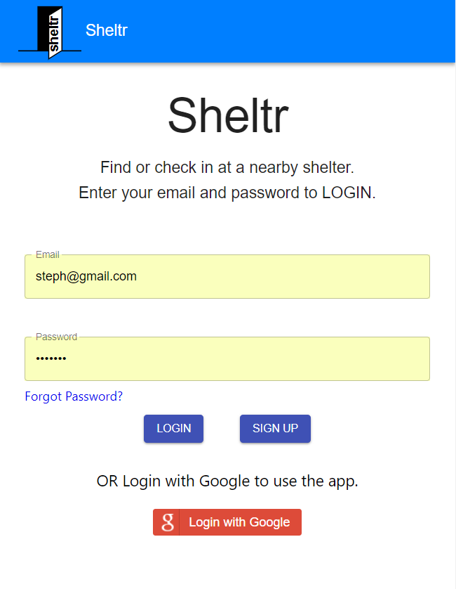

### Sign up page

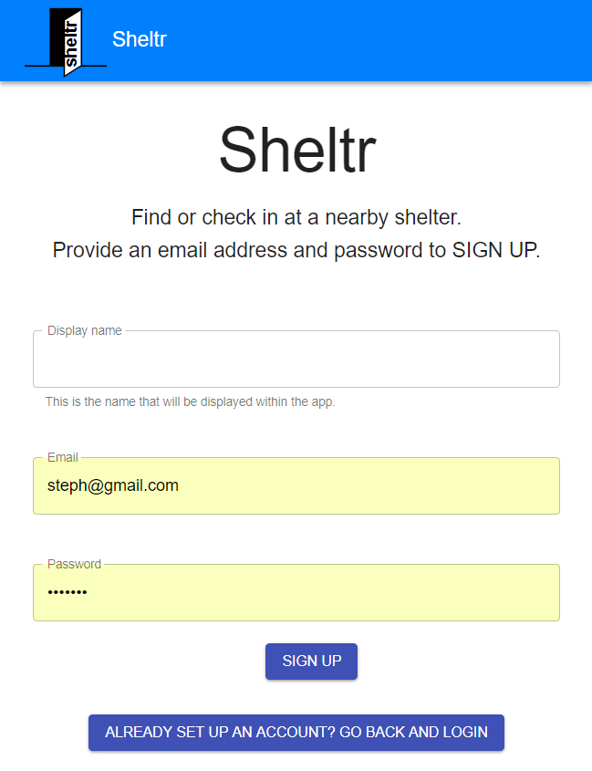

### My profile page

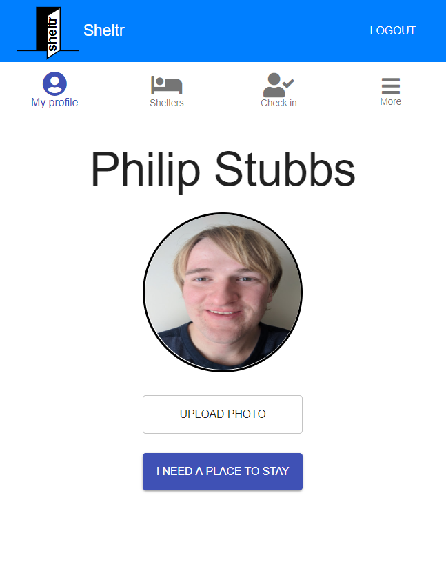

### Shelters page - list view

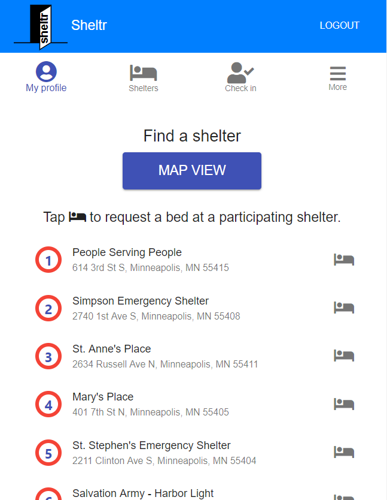

### Shelters page - map view

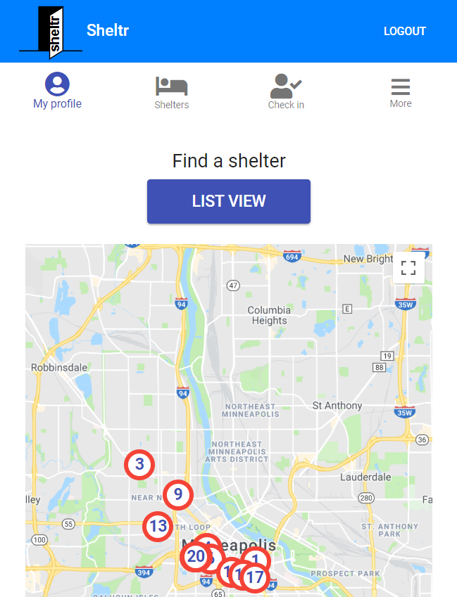

### Shelter information page

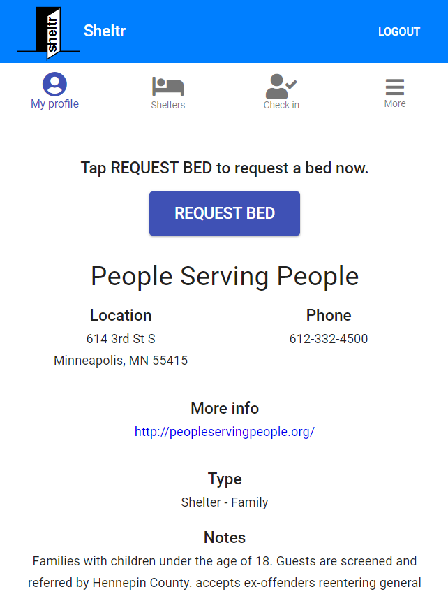

### Check in page

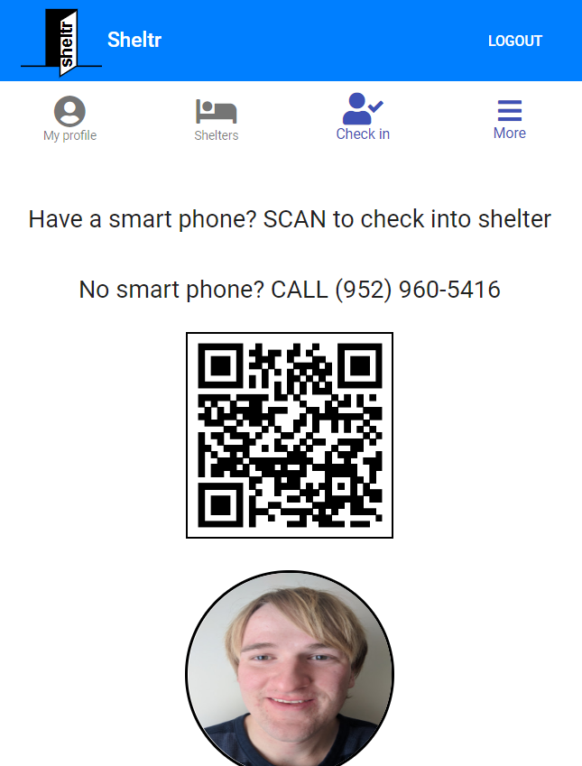

### Help page


### About page

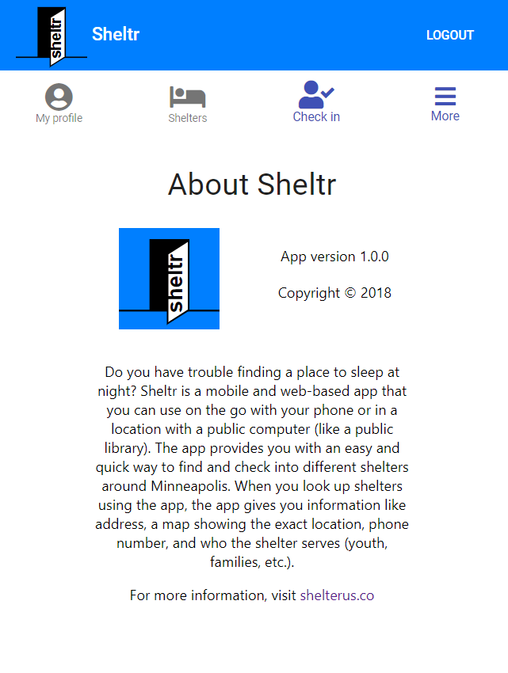

### Report error page

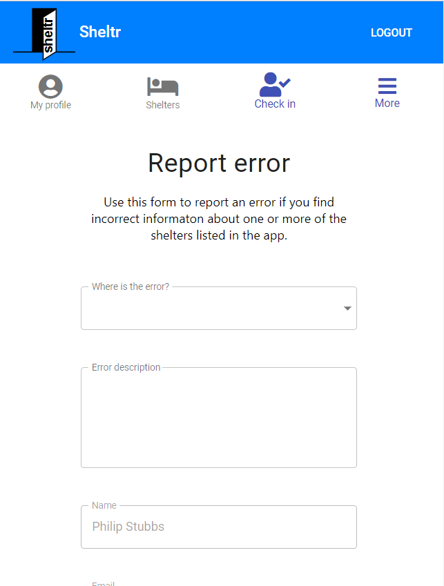

### Delete account page

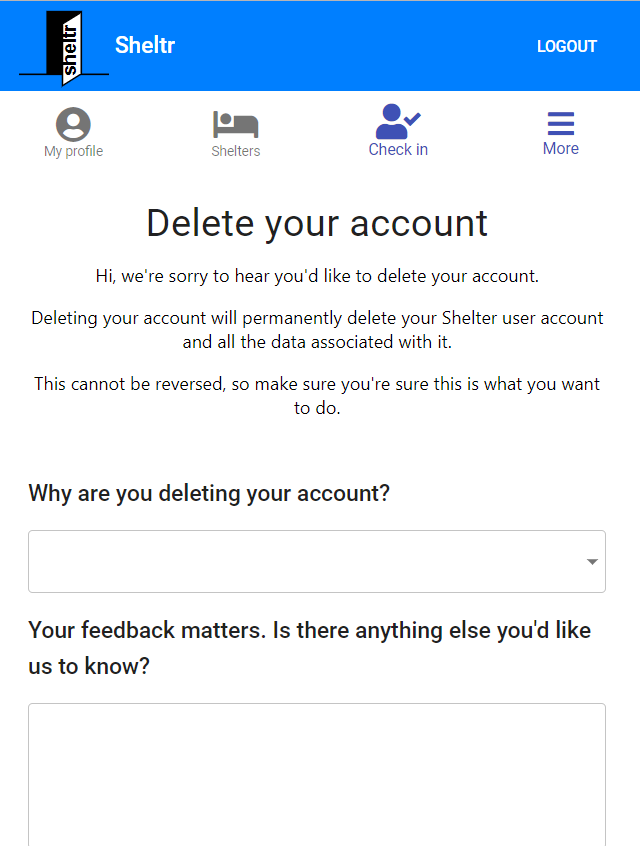

## <a name="about-this-project"></a> About this project

This project was a group project I worked on with two other individuals as part of Twin Cities Startup Weekend 2018. Startup Weekend is an event where you have 54 hours to come up with an idea for a startup, form a team, validate the idea by doing user research and talking to customers, create a prototype of the idea, and do a business pitch of that idea to a panel of entrepreneurs at the end of the event. The whole point of startup weekend is not to have a startup company by the end of the weekend. But rather, the point is to better understand the process of what it takes to work with a team to build a startup.

For more information about the event, see <http://communities.techstars.com/usa/twincities/startup-weekend/13367>.

Whether you are a business person who has an idea for a startup or are a developer just looking to improve your coding skills with building a prototype, I would highly recommend participating in startup weekend at least once. This event has something for everyone. You won't regret it. It is truly an eye opening experience to see the constant challenges, obstacles, and grind of the startup world. 

For me, I participated in this event as the lead developer on my team and was the one primarily responsible for building the prototype and user interface of the app. Because of the time constraint (only had 12 hours to build the UI) to get something built for demo purposes, I built the prototype using React. React is a JavaScript user interface framework that Facebook developed for the purposes of building component-based applications. Using React made it very easy to get a working demo app in less than 12 hours.

At the conclusion of startup weekend, our team and app idea ended up winning 1st place. If you have any questions or comments regarding my experience at startup weekend or regarding the app I built, feel free to send me an email at philipstubbs13@gmail.com. As a side note, I'm also looking for developers to help me fully develop and build out the app. So, if you are a developer still reading this and are interested in contributing to this project, let me know.

### <a name="photos"></a> Photos from Twin Cities Startup Weekend 2018

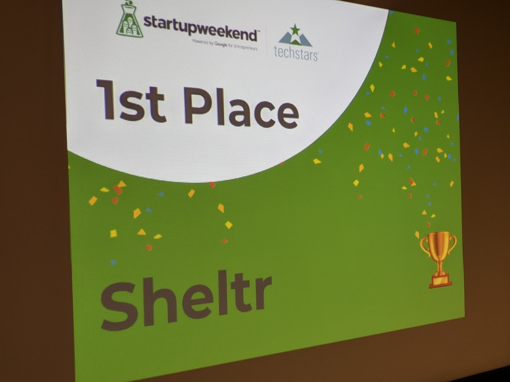

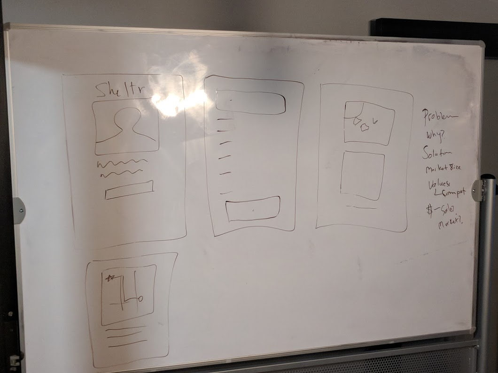

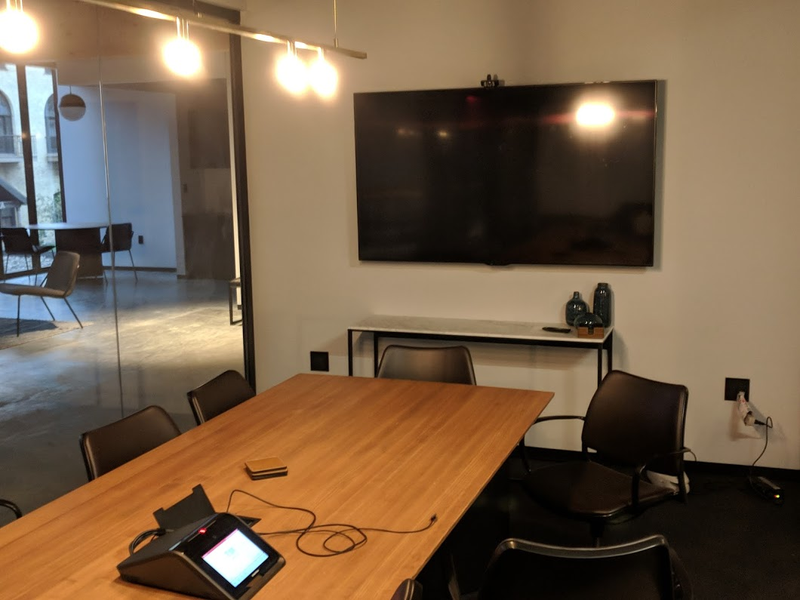

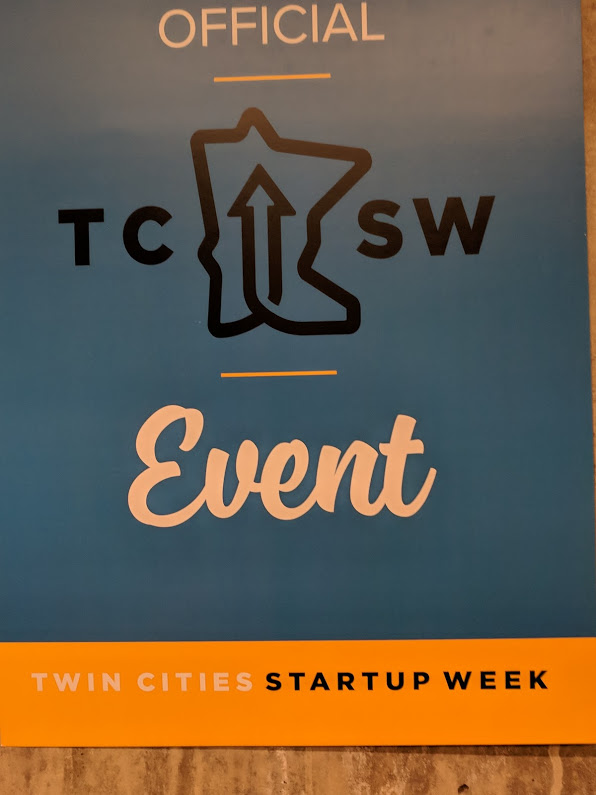

### <a name="pitch"></a> Business pitch

At the end of Twin Cities Startup Weekend 2018, our team had to pitch our idea to a panel of 3 entrepreneurs. The slides for the pitch are located here: <https://docs.google.com/presentation/d/1kuuWJGiohRupLT7kvaxcuI-vByM5n4nbDSzPFsdsHqY/edit?usp=sharing>

### <a name="how-the-app-is-built"></a> How the app is built

On the front end side, this project is built using React, which is an open-source JavaScript library developed at Facebook specifically for the task of developing user interfaces. React relies on a component-based architecture where elements of the user interface are broken into small chunks of code called components. To design and build the user interface, I used the Material UI user interface React component library.

On the backend, this project uses Firebase for real-time data storage in a database. It also uses email-based and Google authentication for signing up and logging in users (which is also  a part of Firebase). This project also uses node, express, and the Twilio API to create a voice messaging system. The voice messaging system allows homeless people who don't have smart phones to still be able to check into a shelter by calling a specific phone number to reserve a bed at a nearby shelter. Finally, Firebase Hosting is used to deploy and host the app.

### <a name="workflow"></a> App workflow

#### Sign up and Log in

When you come to the app, the first thing you need to do is sign up (if you are a new user) and log in to the app. The signup and login process is pretty straightforward and quick. To sign up, you can enter an email and password or sign up using your Google account. Having you log into the app prevents unauthorized people from gaining access to your account if your phone is lost or stolen. It also helps shelters and cities track you by tracking who is using the app.

#### My profile page

The My profile page is a basic profile page for you that includes your name and photo for identification purposes. This page helps shelters identify you quickly at check in and provides you with another form of identification if you lose or misplace your primary id. From this page, you can upload a new photo or click <b>I NEED A PLACE TO STAY</b> to see a list of shelters nearby.

#### Shelters page - list view

The app provides a list of shelters that you can use to quickly look up homeless shelters in Minneapolis. Each shelter listed in the app has information like street address, phone number, website, shelter type, any additonal notes, as well as a map showing the shelter's location. For each participating shelter in the app, you can click <b>REQUEST BED</b> when viewing information for a particular shelter to send your information to that shelter.

#### Shelters page - map view

In addition to the ability to see a list of shelters, it is also possible to see one map of all the shelters in Minneapolis. This makes it easier for you to see exactly how far you are from certain shelters.

#### Check in page

When you are ready to check into a shelter, you go to the Check in page. On the Check in page, there are 2 ways to check into a shelter. If you have a smartphone, you can simply have the homeless shelter scan the QR code that contains your information to check you in from the app. If you don't have a smartphone, you can call the number listed on this page, which will take you through a voice messaging system to check you in. This voice messaging system uses the Twilio API.

#### More information from the app menu

Finally, for more information, you can go to the app menu (hamburger menu). The app menu includes a link to the app help page, about page, and report error page for reporting errors within the app. It also includes a link to the delete account page if you decide you no longer want the app and want to permanently delete your app account.

### <a name="project-structure"></a> Structure of the project

After you clone the repository from GitHub, you can navigate to the project root directory (tcsw-sheltrus). The project directory structure will be set up as follows:

* <b>client</b>: This folder is where all the client-side code/React app lives.
  * <b>public</b>: The public folder contains the main index.html file. This HTML file is a template. The file is empty. So, if you open it directly in a browser, you will get an empty page. Rather than placing the HTML code directly in index.html, this site uses a React component-based architecture to create, build, and render UI components to the page.
  * <b>src</b>: The src folder is where the React components reside.
    * <b>App.js</b>: The App.js file is where the components are imported and rendered, such as the top navigation bar, footer, and various pages.
    * <b>index.js</b>: The index.js file is the top level file of the React app. In index.js, the App.js file is imported, and the ReactDOM.render method is used to render App.js to the page.
    * <b>components</b>: The Components folder is where the components that are reused across the site are located. Each file represents a separate component. For example, Button.js is the button component that can be reused across the entire app for a consistent look and feel for each button.
    * <b>containers</b>: Holds all the pages of the app and the child components within those pages. For example, inside of the containers folder, there is a Profile folder. The Profile folder contains a top-level parent container/page called Profile.js
    * <b>App.css</b> and <b>index.css</b>: The external css stylesheets for the app.
    * <b>firebase-config.js</b>: contains the Firebase initialization code to connect the app to Firebase.
    * <b>sheltr-b2.svg</b>: This is the svg version of the app logo.
  * <b>.eslintrc.json</b>: List of rules and their definitions for ESLint.
  * <b>.gitignore</b>: Anything listed inside this file (for example, node_modules) will not be tracked by GitHub when code is committed.
  * <b>package.json</b>: Lists the project dependencies for the client and their version numbers.
  * <b>README.md</b>: The README file that came with setting up a create-react-app project.
  * <b>yarn.lock</b>: Dependency tree for the project. Lists all the client dependencies and their versions.
* <b>functions</b>: Folder for storing Firebase cloud functions. Currently not in use for anything.
* <b>readme_images</b>: Images used in the project README file.
* <b>.firebaserc</b>: Hidden file that allows you to quickly switch between projects with 'firebase use'.
* <b>.gitignore</b>: Anything listed inside this file (for example, node_modules) will not be tracked by GitHub when code is committed.
* <b>firebase.json</b>: Firebase configuration file required to deploy the app to Firebase.
* <b>package.json</b>: Lists the project dependencies and their version numbers.
* <b>yarn.lock</b>: Dependency tree for the project. Lists the project dependencies and their versions.
* <b>server.js</b>: Contains the code to set up express and make a post request using the Twilio API to create a voice messaging system.
* <b>README.md</b>: The README file that contains important information about this project.
* <b>make-call.js</b>: Contains the JavaScript code to make a phone call using the Twilio API.

## <a name="getting-started"></a> Getting started

The following section will take you through the steps of setting up this app and getting it running locally on your computer.

If you don't want to set up this project locally and just want to see the deployed app, go to <https://tcsw-homeless.firebaseapp.com/>.

To set up this app locally on your computer, perform the following steps:

  1. [Clone the repository](#clone-repository)
  2. [Install Node.js](#install-node)
  3. [Install yarn](#install-yarn)
  4. [Install the project dependencies](#dependencies)
  5. [Start the React development server](#start-server)

###  <a name="clone-repository"></a> 1. Clone the repository
The first step is to clone the project repository to a local directory on your computer. To clone the repository, run the following commands:

```bash
git clone https://github.com/philipstubbs13/tcsw-sheltrus.git
cd ./tcsw-sheltrus
```

###  <a name="install-node"></a> 2. Install Node.js

<p>If you don't already have Node.js installed on your computer, you can install the latest version <a href="https://nodejs.org/en/">here</a>.</p>

### <a name="install-yarn"></a> 3. Install yarn

To be able to install the dependencies and start the app locally, you will need to install yarn. Yarn is a package manager like npm.

To install yarn globally, run the following command:

```
npm install -g yarn
```

For more information about yarn and other installation options, see the yarn documentation: <https://yarnpkg.com/en/>.

### <a name="dependencies"></a> 4. Install the client project dependencies

Change directory into the <b>client</b> directory and run the following command to install the required client dependencies:

```bash
yarn install
```

The following packages are dependencies to the project.

* [@material-ui/core](https://www.npmjs.com/package/@material-ui/core)
* [@material-ui/icons](https://www.npmjs.com/package/@material-ui/icons)
* [classnames](https://www.npmjs.com/package/classnames)
* [create-react-class](https://www.npmjs.com/package/create-react-class)
* [google-map-react](https://www.npmjs.com/package/google-map-react)
* [google-maps-react](https://www.npmjs.com/package/google-maps-react)
* [history](https://www.npmjs.com/package/history)
* [lodash](https://www.npmjs.com/package/lodash)
* [firebase](https://www.npmjs.com/package/firebase)
* [prop-types](https://www.npmjs.com/package/prop-types)
* [react](https://www.npmjs.com/package/react)
* [react-dom](https://www.npmjs.com/package/react-dom)
* [react-file-input](https://www.npmjs.com/package/react-file-input)
* [react-firebase-file-uploader](https://www.npmjs.com/package/react-firebase-file-uploader)
* [react-router-dom](https://www.npmjs.com/package/react-router-dom)
* [react-scripts](https://www.npmjs.com/package/react-scripts)

This project also uses ESLint, which includes the following dependencies:

* babel-eslint
* eslint
* eslint-config-airbnb
* eslint-plugin-import
* eslint-plugin-jsx-a11y
* eslint-plugin-react

Version information for each of these packages is available in the <b>package.json</b> file in the <b>client</b> directory.

After you install the client dependencies, change directory to the project root directory (tcsw-sheltrus) and run <pre>yarn install</pre> to install the remaining dependencies:

* [express](https://www.npmjs.com/package/express)
* [twilio](https://www.npmjs.com/package/twilio)

###  <a name="start-server"></a> 5. Start the React development server.

<p>After performing all of the setup steps in the <b>Getting started</b> section, navigate to the project root directory (<b>tcsw-sheltrus</b>) and run the following command to start the React development server.</p>
<pre>yarn start</pre>

<p>After the development server has started, a Chrome browser window should open, and you should see the app. If the browser does not automatically open after the server starts, you can verify that the app is working locally on your computer by opening Chrome and going to <a href="http://localhost:3000">http://localhost:3000</a>. Note that by default, the development server will try to start up on port 3000. If port 3000 is already in use on your computer, then the development server will use a different port.

<p><b>Tip</b>: if you are having difficulty starting the React development server, try creating a <b>.env</b> inside of the <b>client</b> directory.</p>

<p>Inside of the <b>.env</b> file, add the following line. Don't forget to also add the <b>.env</b> file to your <b>.gitignore</b> file so that it is not pushed to GitHub when code is committed. This tip helped solve my server start issues, so I thought I would share it.</p>

```bash
SKIP_PREFLIGHT_CHECK=true
```

## <a name="twilio"></a> Instructions for setting up Twilio

Coming soon...

## <a name="deployment"></a> Deploying the app

This site is deployed to Firebase using Firebase Hosting. For more information on hosting with Firebase, see <https://firebase.google.com/docs/hosting/>. To deploy the app, you will need to build a production version of the app as well as have the Firebase CLI installed.

1. If not already installed, install the Firebase CLI globally by running the following command:

```bash
npm install -g firebase-tools
```

This installs the firebase command globally. To update to the latest version, simply re-run the same command.

2. To connect your local machine to your Firebase account and obtain access to the Firebase project, run the following command:

```bash
firebase login
```

3. Change directory to the <b>tcsw-sheltrus/client</b> directory.

4. If you have deployed the app before, there will be a build directory inside <b>client</b>. Delete the existing <b>build</b> directory.

5. Run the following command to build a clean, production version of the app.
<pre>yarn build</pre>
<p>This command creates a directory called <b>build</b> inside of the <b>client</b> directory.</p>

6. Commit changes to git (if not done already).

7. Run the following command to deploy your changes:

```bash
firebase deploy
```

This command deploys the project to <https://tcsw-homeless.firebaseapp.com/> on firebase.

## <a name="technologies-used"></a> Technologies used to create app

* [Back end technolgies](#Backend)
* [Front end technologies](#Frontend)
* [Other technologies](#Other)

### <a name ="Backend"></a> Back end technologies

* Firebase Hosting (<https://firebase.google.com/docs/hosting/>)
* Firebase Authentication (<https://firebase.google.com/docs/auth/>)
* Firebase Realtime Database (<https://firebase.google.com/docs/database/>)
* Twilio API (<https://www.twilio.com/docs/usage/api>)
* Express (<https://expressjs.com/>)

### <a name="Frontend"></a> Front end technologies

* HTML5
* CSS
* Javascript (ES6)
* React (<https://reactjs.org/>)
* Material UI (<https://material-ui.com/>)

### <a name="Other"></a> Other technologies

* ESLint
* Lodash
* Google Maps

## <a name="future"></a> Direction for future development

Source code will be developed over time to handle bug fixes and incorporate new features

The following is a list of potential enhancements for future code development.

* Add functionality that allows a user to actually submit shelter intake form to shelter directly from the app.
* Add additional forms of authentication like phone number, Facebook, Twitter, etc.
* Add a resources page that provides contact information for various resources like food shelves, soup kitchens, mental health facilities, health clinics, etc.
* Migrate app from Firebase to AWS.

## <a name ="Issues"></a> Issues

<p>If you find an issue while using the site or have a request, <a href="https://github.com/philipstubbs13/tcsw-sheltrus/issues/" target="_blank">log the issue or request here</a>. These issues will be addressed in a future code update.</p>