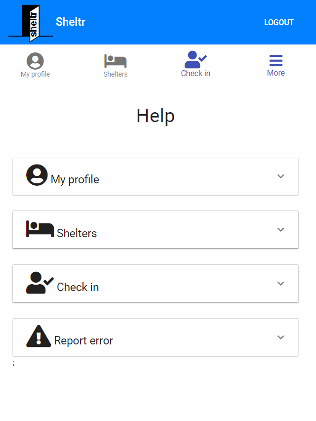

# Sheltr

Over the years, the process a homeless person has to go through to find, locate, and check into a homeless shelter has not necessarily gotten more difficult, but it definitely hasn't gotten any easier. Even after a homeless person goes through that process and fills out a shelter intake form, there is no guarantee that they have a spot at a shelter to sleep at night. Even if they do find a shelter to stay at, they have to repeat that process over and over, night after night.

This complex process has led to a rise in people sleeping on the streets, a rise in homeless camps along Minneapolis highways, and people dying from being denied a warm place to sleep at night. One of the fastest growing homeless demographic is youth. Many youth are turning to the streets for a variety of reasons and even using the light rail service in Minneapolis at night to keep warm.

This project hopes to solve and slow down the rapidly growing homeless crisis in Minneapolis. The project is a mobile and web based app intended for homeless people to use as a resource and intended to help streamline the process of checking into a shelter. The short term goal of this app is to get homeless people into a shelter easily and quickly each night. The long term goal of this app is to provide an opportunity for homeless people to rebuild their lives and get off the streets for good.

## Table of contents

* [Live](#live)
* [Screenshots](#screenshots)
* [About this project](#about-this-project)
  * [Business pitch](#pitch)
  * [How the app is built](#how-the-app-is-built)
  * [App workflow](#workflow)
  * [Structure of the project](#project-structure)
* [Getting started](#getting-started)
* [Deploying the site](#deployment)
* [Technologies used to create the app](#technologies-used)
  * [Back end technologies](#Backend)
  * [Front end technologies](#Frontend)
  * [Other technologies](#Other)
* [Direction for future development](#future)
* [Issues](#Issues)

## Live

The app is current live at the following URL:
<https://tcsw-homeless.firebaseapp.com/>

##  Screenshots

### Login page

### Sign up page

### My profile page

### Shelters page - list view

### Shelters page - map view

### Shelter information page

### Check in page

### Help page

### About page

### Report error page

### Delete account page

##  About this project

This project was a group project I worked on with two other individuals as part of Twin Cities Startup Weekend 2018. Startup Weekend is an event where you have 54 hours to come up with an idea for a startup, form a team, validate the idea by doing user research and talking to customers, create a prototype of the idea, and do a business pitch of that idea to a panel of entrepreneurs at the end of the event. The whole point of startup weekend is not to have a startup company by the end of it but to better understand the process of what it takes to work with a team to build a startup.

For more information about the event, see <http://communities.techstars.com/usa/twincities/startup-weekend/13367>.

Whether you are a business person who has an idea for a startup or are a developer just looking to improve your coding skills in building a prototype, I would highly recommend participating in startup weekend at least once. This event has something for everyone. You won't regret it. It is truly an eye opening experience to see the constant challenges, obstacles, and grind of the startup world. 

For me, I participated in this event as the lead developer on my team and was the one primarily responsible for building the prototype of the app. Because of the time constraint to get something built for demo purposes, I built the prototype using React. React is a JavaScript user interface framework that Facebook developed for the purposes of building component-based applications. Using React made it very easy to get a working demo app in less than 12 hours.

At the conclusion of startup weekend, our team and app idea ended up winning 1st place. If you have any questions or comments regarding my experience at startup weekend or regarding the app I built, feel free to send me an email at philipstubbs13@gmail.com. As a side note, I'm also looking for developers to help me fully develop and build out the app. So, if you are a developer still reading this and are interested in contributing to this project, please reach out.

###  Business pitch

At the end of Twin Cities Startup Weekend 2018, our team had to pitch our idea to a panel of 3 entrepreneurs. The slides for the pitch are located here: <https://docs.google.com/presentation/d/1kuuWJGiohRupLT7kvaxcuI-vByM5n4nbDSzPFsdsHqY/edit?usp=sharing>

###  How the app is built

On the front end side, this project is built using React, which is an open-source JavaScript library developed at Facebook specifically for the task of developing user interfaces. React relies on a component-based architecture where elements of the user interface are broken into small chunks of code called components. To design and build the user interface, I used the Material UI user interface React component library.

On the backend, this project uses Firebase for real-time data storage in a database. It also uses email-based and Google authentication for signing up and logging in users (which is also  a part of Firebase). This project also uses node, express, and the Twilio API to create a voice messaging system. The voice messaging system allows homeless people who don't have smart phones to still be able to check into a shelter by calling a specific phone number to reserve a bed at a nearby shelter. Finally, Firebase Hosting is used to deploy and host the app.

###  App workflow

#### Sign up and Log in

When you come to the app, the first thing you need to do is sign up (if you are a new user) and log in to the app. The signup and login process is pretty straightforward and quick. To sign up, you can enter an email and password or sign up using your Google account. Having you log into the app prevents unauthorized people from gaining access to your account if your phone is lost or stolen. It also helps shelters and cities track you by tracking who is using the app.

#### My profile page

The My profile page is a basic profile page for you that includes your name and photo for identification purposes. This page helps shelters identify you quickly at check in and provides you with another form of identification if you lose or misplace your primary id. From this page, you can upload a new photo or click <b>I NEED A PLACE TO STAY</b> to see a list of shelters nearby.

### Shelters page - list view

The app provides a list of shelters that you can use to quickly look up homeless shelters in Minneapolis. Each shelter listed in the app has information like street address, phone number, website, shelter type, any additonal notes, as well as a map showing the shelter's location. For each participating shelter in the app, you can click <b>REQUEST BED</b> when viewing information for a particular shelter to send your information to that shelter.

### Shelters page - map view

In addition to the ability to see a list of shelters, it is also possible to see one map of all the shelters in Minneapolis. This makes it easier for you to see exactly how far you are from certain shelters.

### Check in page

When you are ready to check into a shelter, you go to the Check in page. On the Check in page, there are 2 ways to check into a shelter. If you have a smartphone, you can simply have the homeless shelter scan the QR code that contains your information to check you in from the app. If you don't have a smartphone, you can call the number listed on this page, which will take you through a voice messaging system to check you in. This voice messaging system uses the Twilio API.

### More information from the app menu

Finally, for more information, you can go to the app menu. The app menu includes a link to the app help page, about page, and report error page for reporting errors within the app. It also includes a link to the delete account page if you decide you no longer want the app and want to permanently delete your app account.

